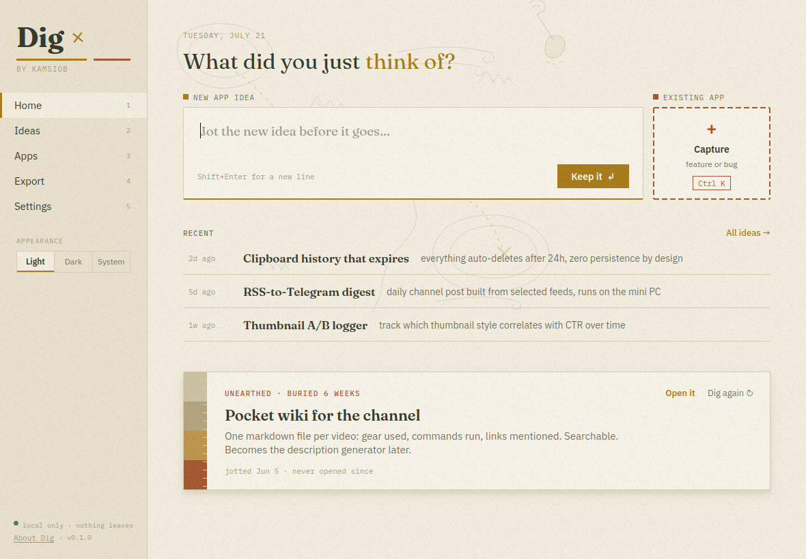
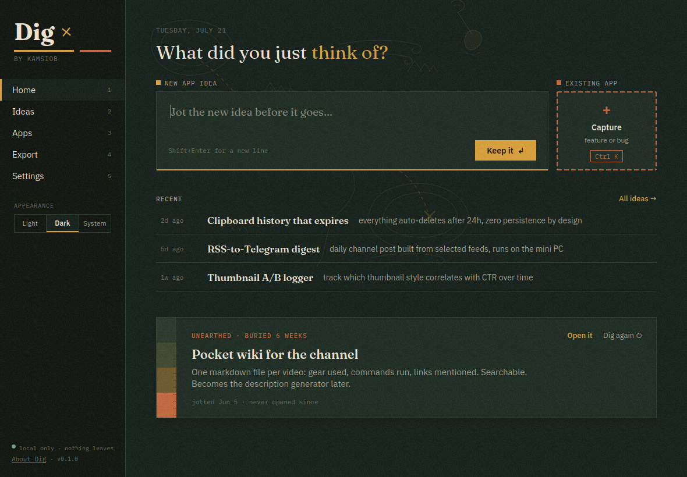
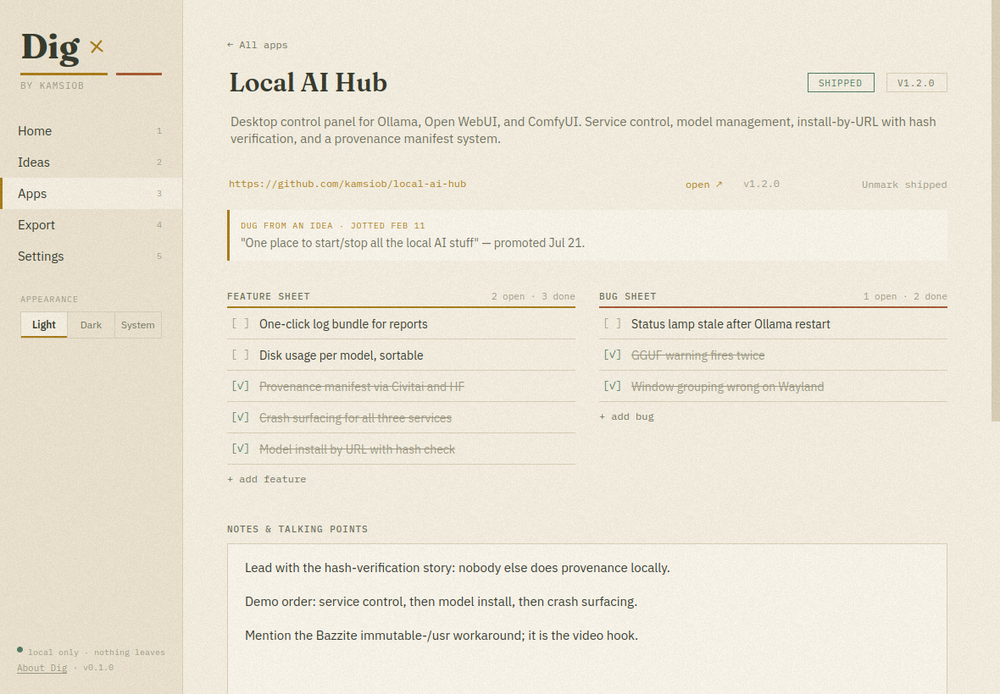
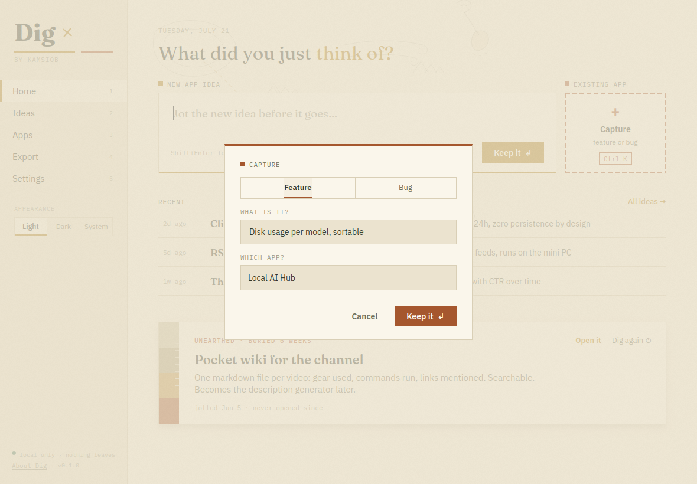

# Dig

**A place to bury ideas and dig them back up.**

Dig is a local-first desktop app registry for vibe coders. Jot an idea the second
it lands, let it settle, and let Dig hand you back an old one you had forgotten.
Promote the ones worth building into apps, and keep a plain feature and bug sheet
for each.

Everything stays on your machine. No account, no telemetry, no network calls.



## What it is, and what it is not

Most tools want your idea to become a ticket. Dig only wants you to write it down
before it goes, and it takes on the one job a notes app never does: bringing an
old idea back up when you have stopped thinking about it.

**Dig is not a project manager.** There are no priorities, no statuses beyond done
and not-done, no dates on tasks, no sprints, and no assignees. Anywhere. Ever. A
line on a sheet is either done or it is not, and that is the whole model.

## The idea of it

- **Jot** — Home opens with the cursor already in the box. First line becomes the
  title, everything after it becomes the note. Enter keeps it, and the cursor
  stays put so the next one can follow straight away.
- **Bury** — ideas simply sit there. Nothing nags, nothing expires.
- **Unearth** — Home shows one older idea at random, drawn from everything below
  the three most recent, with how long it has been in the ground. "Dig again"
  redraws and never hands back the one already showing.
- **Promote** — an idea worth building becomes an app, and the original jot stays
  attached to it as its origin. The thread from a stray thought to a shipped
  thing stays visible.

## Features

- Jot capture with a keyboard-only path from empty screen to saved idea
- Random resurfacing of old ideas, with "buried 6 weeks" and "never opened since"
- Full idea ledger with live search; promoted ideas kept out of the way but never
  destroyed
- App registry with SHIPPED and version chips, live open counts, and an origin
  callout back to the jot it came from
- Feature and bug sheets: click to toggle done, inline add, and nothing else
- Notes, screenshots and file attachments, copied into Dig's own folder rather
  than referenced where they sit
- Capture dialog on **Ctrl K** from any screen, for a feature or bug on an
  existing app
- PDF portfolio export: a cover, one page per app with screenshots, and a closing
  page of ideas still in the ground
- Two full themes that follow the desktop if you ask them to

## Screenshots

| Home, dark | App detail |
|---|---|
|  |  |



## Install

Built and tested on Bazzite with KDE Plasma on Wayland. Anything with Python 3.11
or newer and a Qt-capable desktop should work.

Everything installs into your home folder. Nothing is written to `/usr`, nothing
asks for root, and no system packages are touched — which is what makes it safe
on Bazzite and other image-based systems where `/usr` is read-only.

```bash
git clone https://github.com/kamsiob/dig.git
cd dig
./install.sh
```

That creates a virtual environment, installs the pinned dependencies, puts a
`dig` launcher in `~/.local/bin`, and registers the icon and menu entry. Then
launch Dig from your application menu, or run `dig`.

To run it from a checkout without installing:

```bash
python3 -m venv .venv
.venv/bin/pip install -r requirements.txt
.venv/bin/python app.py
```

To remove it:

```bash
./uninstall.sh
```

Uninstalling deliberately leaves your data alone. It prints the folder so you can
delete it yourself if you want the ideas gone too.

## Keyboard

| Key | What it does |
|---|---|
| `1` – `5` | Home, Ideas, Apps, Export, Settings |
| `Ctrl K` | Capture a feature or bug against an app, from any screen |
| `Enter` | Keep the jot, commit a sheet line, or save the capture |
| `Shift Enter` | New line inside a jot |
| `Esc` | Clear the search, cancel an inline add, close a dialog |
| `Tab` | Move through everything; every focus state is visible |

On Home the jot field holds focus, so a number key typed there is a number, not a
jump. Capturing the thought is the point of that screen.

A system-wide hotkey is deliberately not attempted: an in-app global key grab does
not work on Wayland. Bind `dig` to a KDE custom shortcut if you want one.

## Your data

Everything lives in `~/.local/share/dig`:

```
dig.db              your ideas, apps, sheets and settings
attachments/<id>/   the files you attached, copied in
```

Attachments are copied into that folder on attach, never referenced where they
sit, so moving or deleting the original leaves Dig intact. Deleting an attachment
deletes the stored copy with it, and deleting an app takes its folder too.

If the database is ever unreadable, Dig sets it aside as
`dig.db.broken-{timestamp}`, starts a fresh one, and tells you plainly. Nothing is
deleted.

The only thing that ever leaves is a PDF you asked for, written where you chose.

## Built with

PySide6 and reportlab, both pinned in `requirements.txt`.

Fonts are bundled, not fetched: **Fraunces**, **IBM Plex Sans** and **IBM Plex
Mono**, all under the SIL Open Font License (see `fonts/OFL-*.txt`). They ship as
static instances cut by `scripts/build_fonts.py`, because Qt loads a variable font
at its default axis position and never varies it.

`DESIGN.md` is the design authority and `design/dig-design.html` is the reference
mockup. Both are in the repo.

## Tests

```bash
.venv/bin/pip install -r requirements-dev.txt
.venv/bin/python -m pytest
```

209 tests, including a scripted end-to-end run that drives the real window
through a week of use: jotting, restarting, promoting, capturing, attaching,
exporting, theming, deleting, and recovering from a corrupted database.

## Kamsiob

- **YouTube** · [Kamsiob on Linux](https://youtube.com/@kamsiob)
- **GitHub** · [kamsiob](https://github.com/kamsiob)
- **Website** · [kamsiob.com](https://kamsiob.com)
- **Telegram** · [Kamsiob Lab](https://t.me/+g5LKm9rUnNcxMjk5)
- **Feedback** · [hello@kamsiob.com](mailto:hello@kamsiob.com)

Dig is free, and it stays free. If it earns its place on your machine you can
[buy me a coffee](https://buymeacoffee.com/kamsiob) — that is the only money link
in the whole app, and it lives in the About dialog.

## License

AGPLv3 — see [LICENSE](LICENSE). Free and open source. Everything stays on your
machine.
