# Dig

Dig keeps every project you are working on in one place: what stage each one is
at, what its next step is, and what you decided along the way. Ideas wait until
you start them. Everything stays on this computer.

It is for one person running several lines of work at once, apps, client work,
personal projects, content, programs, who wants to open one window and see where
everything actually stands.

Dig makes no outbound internet requests of any kind. There are no accounts and
no cloud. Sync is off by default, and when you turn it on it is a direct
connection between your own devices on your own private network, with nothing
passing through anyone else's servers.

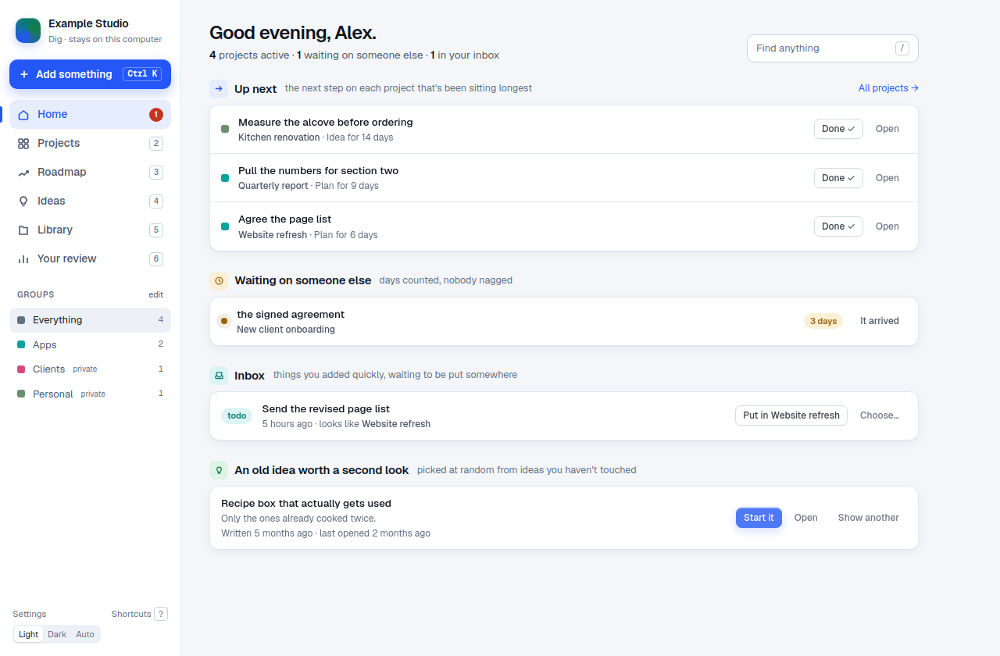

## What it does

- **Projects and stages.** Every project has a type, and a type decides which
  stages it moves through and what each stage's checklist suggests. You decide
  when something moves. No boards, no dragging.
- **Next steps.** One line per project saying the single thing that moves it
  forward. Home shows the four that have been sitting longest.
- **Waiting on someone else.** Mark what a project is waiting for. Dig counts
  the days and never nags anyone.
- **A roadmap at every level.** Now, Next, Later, Someday, for everything or for
  one group.
- **Ideas.** Things you might make one day, with no stage and no deadline. Dig
  brings an old one back for a second look now and then.
- **Decisions.** Numbered, dated, permanent. Replaced ones stay visible, crossed
  out, so the reasoning survives.
- **Releases and files.** What shipped and when, and the documents that came
  with it, kept inside Dig.
- **Groups.** Every group has a page: what it is for, where all its projects
  have got to, its own roadmap, files, links, decisions, and log.
- **A log.** Dated notes on a project or a group. What happened, in order,
  separate from the one standing description.
- **Your review.** Written from what actually happened: stage changes,
  decisions, releases, waits, documents issued, and anything you marked as a
  highlight. This week, last week, this month, this quarter, or a range you
  pick. If nothing moved, it says so.
- **Files.** Any type, kept once by content, viewed inside Dig: images, PDFs,
  text with line numbers, Markdown, CSV as a table, audio and video. Save a copy
  or save them all as a zip with a manifest.
- **Nothing is lost.** Deleting anything sends it to Recently deleted for thirty
  days. Back up everything, including your files, as one zip.
- **Sharing.** A PDF of one project, of your projects, of the roadmap, or of the
  week. Private groups never appear, and every export says what was left out.

## What it looks like

| | |
|---|---|
| 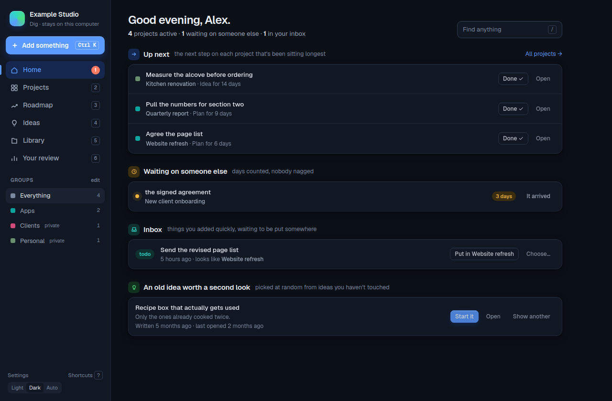 | 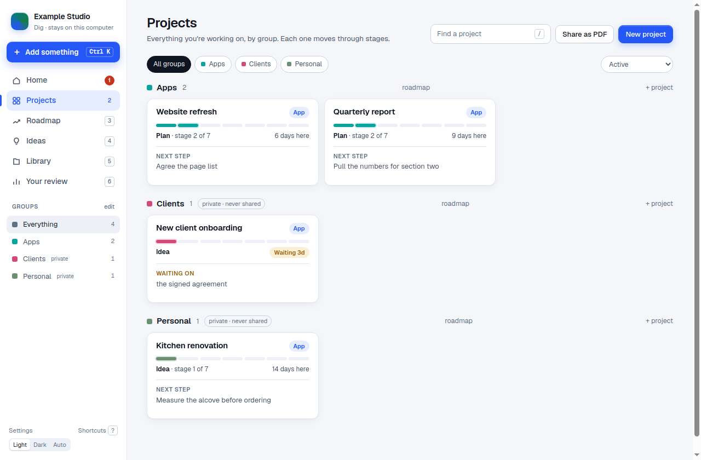 |
| Home in the dark. The same four things, whichever way your desktop is set. | Every project, by group, with how far along each one is. |
| 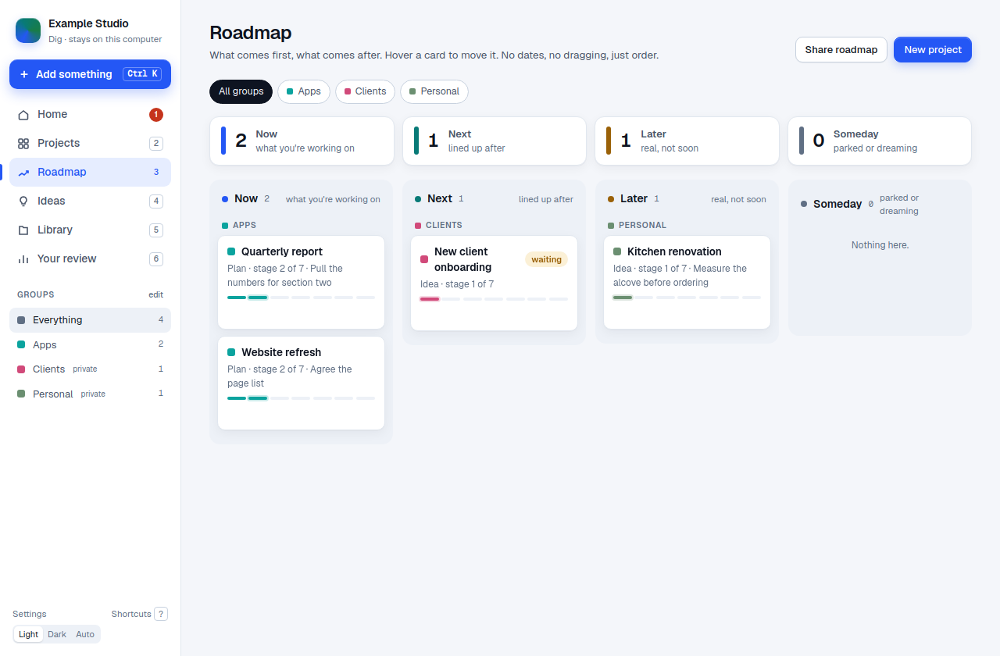 | 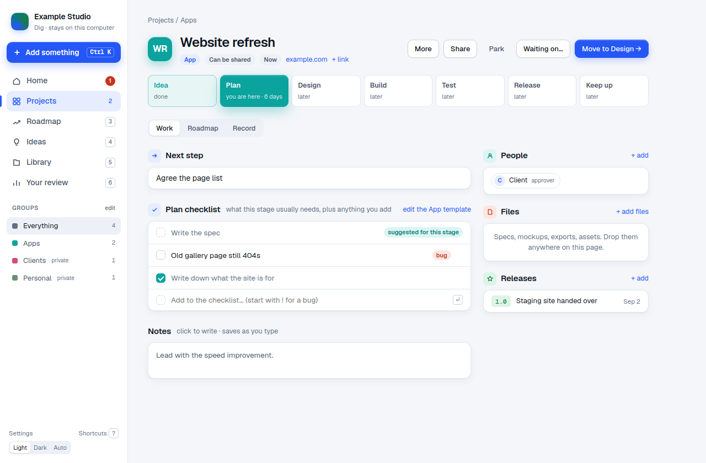 |
| Now, Next, Later, Someday. No dates, no dragging. | One project: its stages, its next step, its checklist, its people and files. |
| 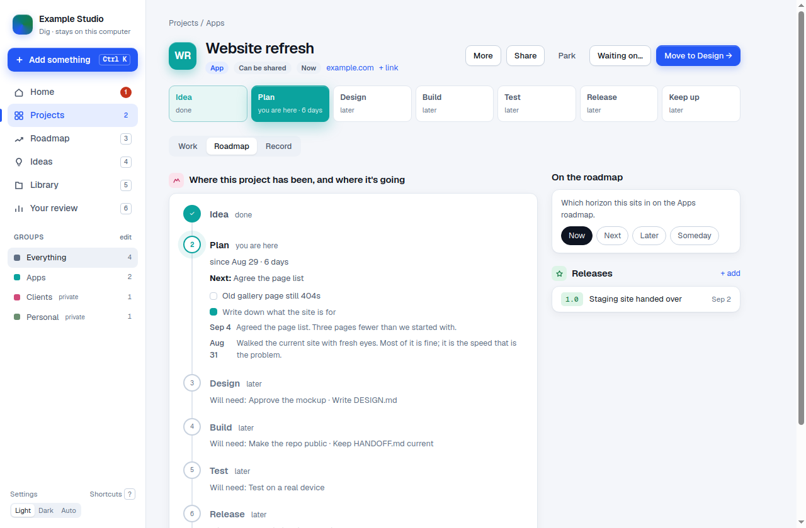 | 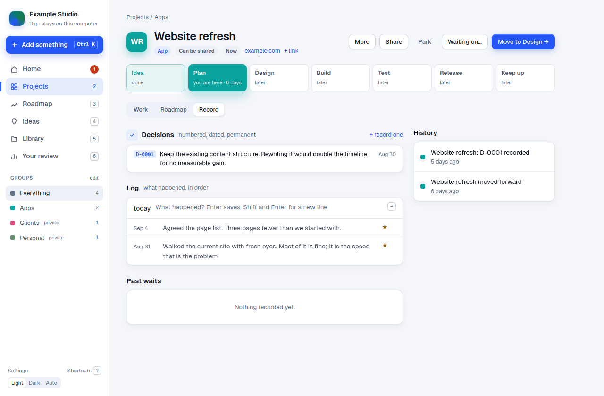 |
| How long each stage took, and what shipped. | Decisions, numbered and dated, and the log of what happened. |
| 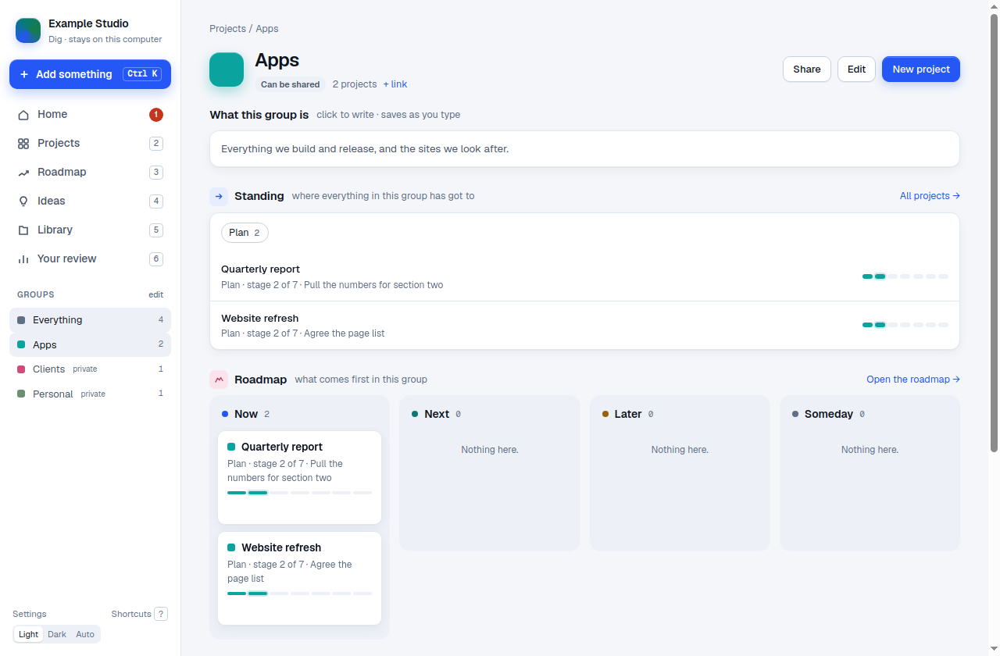 | 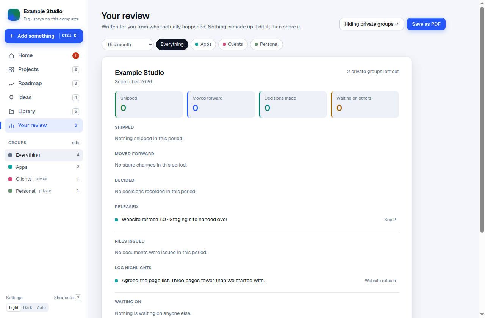 |
| A group's own page: what it is for, where everything in it has got to. | Written from what actually happened. Nothing is made up. |
| 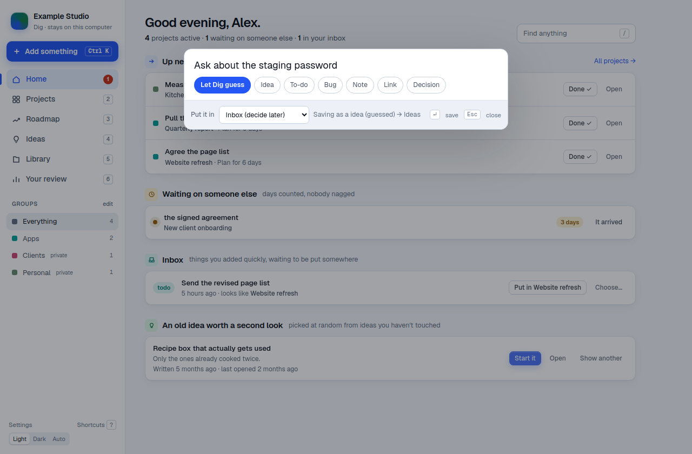 | 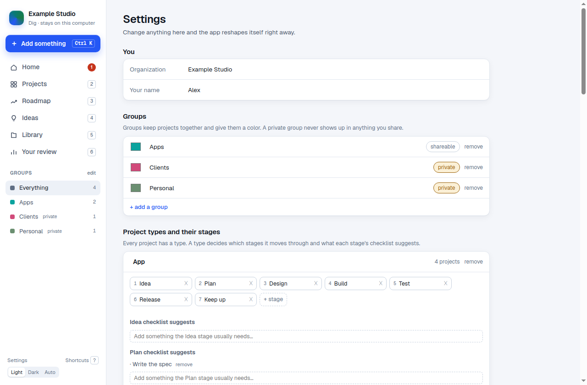 |
| <kbd>Ctrl</kbd> <kbd>K</kbd> from anywhere. It says where what you typed is going. | Groups, types, stages, sync, backups, text size. |

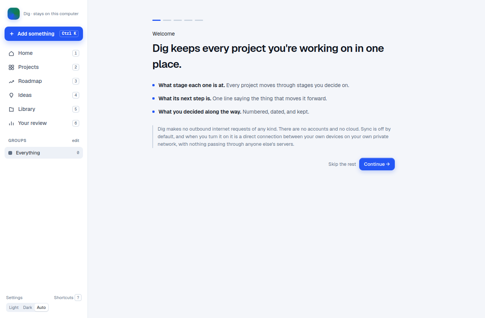

The first run walks through five steps and can be replayed any time from
Settings. It can put a small set of example projects in so there is something
to look at, and take them all out again in one click.

## What Dig is not

These are decisions, not gaps. Dig has no boards or drag and drop, no due dates
on tasks, no priorities, no assignees, no time tracking, no money or invoicing,
no notifications, no accounts or cloud, and no AI.

## Running it

Dig needs Python 3.11 or newer and PySide6 with QtWebEngine. On Bazzite and
other image based systems everything installs into your home folder; nothing is
written to `/usr` and nothing asks for root.

```
git clone https://github.com/Kamsiob/dig.git
cd dig
./install.sh
```

That creates a virtual environment (reusing a system PySide6 if there is one),
installs the icon and the launcher, and puts a `dig` command on your PATH. Then
launch Dig from your applications menu, or run `dig`.

`./uninstall.sh` removes the launcher, the icons, and the command. It never
touches your data.

## From the terminal, or a keyboard shortcut

Dig runs as a single instance. A second launch hands its arguments to the copy
you already have open and exits.

```
dig                                    open Dig
dig add "text"                         put it in the inbox
dig add "text" --idea                  as an idea
dig add "text" --bug                   as a bug
dig add "text" --note                  keep it in the Library
dig add "text" --link                  keep a link in the Library
dig add "text" --project "Website refresh"
                                       onto that project's checklist
dig add "text" --log --project "Website refresh"
                                       as a dated log entry
dig open "Website refresh"             open that project
```

### A system wide capture key on KDE

Wayland does not let an application grab a global key for itself, and Dig will
not pretend otherwise. Bind the command instead, which works the same and stays
under your control:

1. System Settings, then Keyboard, then Shortcuts, then Add Command.
2. Command: `sh -c 'dig add "$(kdialog --inputbox "Add to Dig")"'`
3. Give it a shortcut, `Meta+D` is a good one.

Whatever you type lands in Dig, and the window you already have open says so.

## Keyboard

| | |
|---|---|
| Add something | <kbd>Ctrl</kbd> <kbd>K</kbd> |
| Find anything | <kbd>/</kbd> |
| Home | <kbd>1</kbd> |
| Projects | <kbd>2</kbd> |
| Roadmap | <kbd>3</kbd> |
| Ideas | <kbd>4</kbd> |
| Library | <kbd>5</kbd> |
| Your review | <kbd>6</kbd> |
| Close anything | <kbd>Esc</kbd> |
| Shortcuts | <kbd>?</kbd> |

## Privacy

Dig makes no outbound internet requests of any kind. There are no accounts and
no cloud. Sync is off by default, and when you turn it on it is a direct
connection between your own devices on your own private network, with nothing
passing through anyone else's servers.

The app enforces that rather than merely intending it: the web view refuses
every request whose scheme is not already on this computer, so a stray link or
a mistyped font URL cannot reach out. There is no telemetry, no crash
reporting, and no update check.

Sync, when you turn it on, binds to loopback and to your Tailscale address and
to nothing else. If there is no Tailscale interface it refuses to start and says
why. Only devices you have paired, with a one time code that works once and
expires in five minutes, can read anything. See [docs/SYNC.md](docs/SYNC.md).

## Your data

Everything lives in `~/.local/share/dig`: one SQLite file holding a record per
thing, the files you have added kept once each by their content, and a rolling
set of recent saves for recovery.

Nothing is ever gone by accident. Deleting anything sends it to Recently deleted
for thirty days. **Back up everything** writes one zip with the whole document
and every file, and restoring takes a backup of what is there first. The JSON
export is the text only, so it is not a backup on its own, and Settings says so.

Dig follows your desktop's light or dark setting, and its reduce motion setting.

## Built by one person

Dig is made and carried by [Kamsiob](https://kamsiob.com).

[YouTube](https://youtube.com/@kamsiob) ·
[GitHub](https://github.com/kamsiob) ·
[Website](https://kamsiob.com) ·
[Telegram](https://t.me/+g5LKm9rUnNcxMjk5) ·
[hello@kamsiob.com](mailto:hello@kamsiob.com)

If software made this way matters to you, there is
[a place to stand behind it](https://buymeacoffee.com/kamsiob). Either way, it
is yours.

## License

AGPLv3. See [LICENSE](LICENSE). Free and open source.
